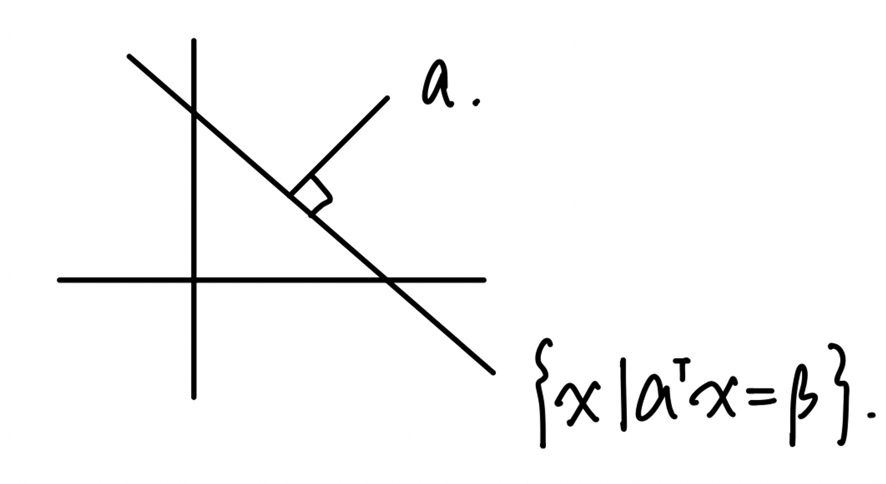

# Convex Set

_**Definition.**_ A set $$C\subseteq \R^n$$ is convex if for any points $$x,y\in C$$ and $$\lambda \in [0,1]$$.

$$
\lambda x+(1-\lambda)y\in C
$$

<figure><figcaption></figcaption></figure>

Familiar Set Convex

Line: fix any $$Z\in \R^n$$. $$0\ne d\in \R^n$$.

$$
L=\{Z+td\mid t\in\R\}
$$

<figure><figcaption></figcaption></figure>

Proof:

$$\begin{aligned}\lambda x+(1-\lambda)y&=\lambda(z+td)+(1-\lambda)(z+td) \\ &=\lambda z+(1-\lambda)z+\lambda d tx+(1-\lambda)dty \\ &=z+(\lambda tx+(1-\lambda)ty)d\end{aligned}$$

Hyperplane: $$H_{\alpha,\beta}={x\in\R^n\mid a^Tx=\beta}$$. where $$a\in \R ^n \backslash \{ 0 \} \& \beta \in \R$$

Ex:

$$\begin{aligned}H_{e,1}&= \{x\mid e^Tx=1 \} \\ &= \{x\mid \sum_{j=1}^n x_j=1 \}\end{aligned}$$

Halfspace: $$H^-_{\alpha,\beta}= \{x\in \R^n\mid a^Tx\le \beta \}$$$$(0\ne a\in\R^n, \beta\in \R)$$

Norm balls: $$B_\square = \{x\in\R^n\mid \lVert x-C\rVert_\square\le r \}$$, where $$C\in\R^n$$ (center) and $$r\in \R_+$$ is radius

<figure><figcaption></figcaption></figure>

Proof: A norm $$\lVert \cdot \rVert:\R^n \to \R_+$$ satisfies the following

1. $$\lVert \alpha x\rVert =\lVert \alpha\rVert \cdot \lVert x\rVert, \forall \alpha \in \R$$
2. $$\lVert x+y\rVert \le \lVert x\rVert +\lVert y\rVert$$
3. $$\lVert x\rVert=0 \Leftrightarrow x=0$$

Example: The set of positive semidefinite matrices

$$S_{n\times n}\equiv \{x\in \R^{n\times n}\mid x \text{ ane PSD}\}$$ is convex

$$Z=\lambda x+(1-\lambda)y$$, where $$X,Y \in S_{n\times n}$$ then $$Z$$ is positive semidefinite.

#### Operations on sets that preserve convexity:

1.  **Intersection**

    For any collection of convex sets $$C_i \in\R^n$$, $$i \in I$$, then $$\underset{i\in I}{\cap}C_i$$ is convex. The union does not preserve convexity.

    Ex: the unit simplex in $$\R^n$$ is the set $$\Delta_n := \{x\in \R^n\mid\sum_{j=1}^nx_j=1,x\ge0\}$$

    $$
    H^-_{e_{2,0}}=\{x\in \R^n\mid x_2\ge 0,x_1\in \R\}
    $$

    Proof: Take $$x,y\in\underset{i\in I}{\cap} C_i$$, show $$\lambda x+(1-\lambda)y\in \underset{i\in I}{\cap} C_i ,\forall \lambda \in [0,1]$$.

    Because $$x,y \in \underset{i\in I}{\cap} C_i \implies x,y\in C_i \forall i\in I$$

    Because $$C_i$$ convex $$\lambda x+(1-\lambda)y\in C_i \forall i \implies \lambda x+(1-\lambda)y\in \underset{i\in I}{\cap} C_i$$

    <figure><figcaption></figcaption></figure>
2.  **Addition.** If $$C_1,C_2,\ldots,C_m$$ are convex sets in $$\R^n$$, then the set addition

    $$
    C_1+C_2+\ldots+C_m=\{Z=x_1+x_2+\ldots+x_m\mid x_i\in C_i, i=1,\ldots,m\}
    $$

    is convex.
3.  **Image of a set.** If $$C\le \R^n$$ is convex and $$A$$ is an $$m\times n$$ matrix, then $$A(c):= \{Ax\mid x\in C \}$$ is convex.

    <figure><figcaption></figcaption></figure>
